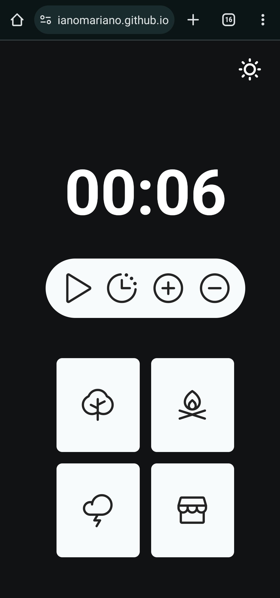
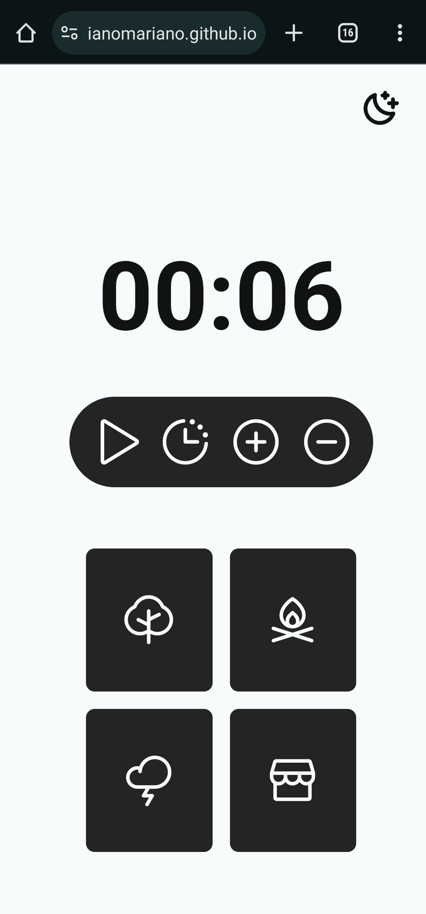

<h1 align="center"> TrickTrack - Temporizador ⏱️ </h1>

O temporizador foi uma aplicação proposta pela RocketSeat no programa de formação WEB EXPLORER e desenvolvida por mim, Juliano Mariano.  

  <a href="#-tecnologias">Tecnologias</a>&nbsp;&nbsp;&nbsp;|&nbsp;&nbsp;&nbsp;
  <a href="#-projeto">Projeto</a>&nbsp;&nbsp;&nbsp;|&nbsp;&nbsp;&nbsp;
  <a href="#-layout">Layout</a>&nbsp;&nbsp;&nbsp;|&nbsp;&nbsp;&nbsp;
  <a href="#-Contato">Contato</a>

 

  
  

## 🚀 Tecnologias

Esse projeto foi desenvolvido com as seguintes tecnologias:

- HTML e CSS
- JavaScript
- Git e Github
- Figma

## 💻 Projeto

Explore o poder da produtividade com o TrickTrack - Timer! 🍅 Escolha entre os modos claro e escuro para personalizar sua experiência. Com quatro fundos inspiradores, encontre o ambiente perfeito para sua concentração e aumente sua eficiência enquanto trabalha ou estuda. Vamos lá, ilumine ou mergulhe na produtividade!

- [Visite o projeto online](https://julianomariano.github.io/TickTrack_Temporizador/)

## 🔖 Layout

Você pode visualizar o layout do projeto através [DESSE LINK](https://www.figma.com/file/7ma8u96F0yGxgPnv4MMIvP/Stage-05---Focus-Timer-2.0-(Copy)?type=design&node-id=0-1&mode=design&t=iwoU2EvPqDpWTfBF-0). É necessário ter conta no [Figma](https://figma.com) para acessá-lo.

## 🌐 Contato

LinkedIn: Juliano Mariano
 -  https://www.linkedin.com/in/juliano-marianodev/